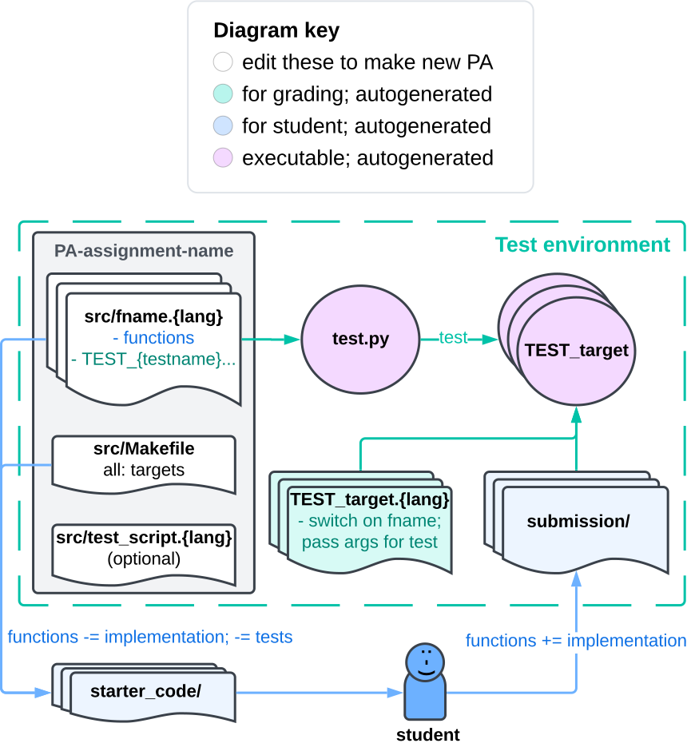

# Course template



## About
This template allows for course staff to easily create new assignments with
maximal automation and speed. The goal is to standardize the creation of
autograders and minimize the footprint of non-boiler-plate code.

Currently this is a python-based framework for python assignments; however, I
want to extend it to other languages as well as add:
 * **✅ enhanced security features**: update: The code is now secure using
   firejail so the subprocess that runs student code:
   * can only *read* input files, classlib.py, and *write* to
     `student_output.txt`
   * cannot elevate its privileges
   * has minimal privilege tied to user groups
   * is restricted in the syscalls it can make using seccomp
   * has no network connectivity
 * **✅ mirror repo for students**: in the top-level Makefile there is a target
   to publish only the starter code for a PA or the contents of a WA. Simply run
   `./publish.sh path/to/dir` and this will copy the non-critical code in that
   dir to `PUBLIC_REPO` (configure this in the Makefile) for students to pull
   the assignments.  This repo's mirror repo is
   <https://github.com/rkulskis/students-course-template>. All you need to do is
   create an empty repo, clone it, and `publish.sh` will take care of the rest!
 * **plagiarism checkers**: against the solution and all past
 submissions. Probably do this asynchronously as a daemon process since only the
 course staff should see the results of whether a student submission was
 possibly plagiarized.
 * **portability to grade assignments on your own cluster** to circumvent
   potential kernel incompatibilities with a custom interface for self-hosting
   and grading code
   (c.f. [NERC_autograder](https://github.com/OpenOSOrg/NERCautograder))
 * **support for other languages**, e.g. Java, C, C++, Go, Rust, SQL. This
 requires polymorphism in the code AST parsing because tree-sitter has different
 node names for different languages. Hopefully this shouldn't be too difficult.
 * **suite of more complex tests**: e.g.:
	 * OOP parse Java directory to give points for properly implemented design
	 patterns.
	 * Big-Oh comparison of student code to solution code
	 * Screenshotting of pyplot output to verify for example that running the
	 student code yields the correct classification of data points
 
## Getting started

## Creating a new repository with this template

In the right-hand side of GitHub click the green box `Use this template` and
create your own private clone of this repo.

## Porting to existing framework of code

Alternatively, to pull this framework into your private course
repository run:
```
git remote add upstream git@github.com:rkulskis/autograder-template.git
git remote set-url --push upstream no_push
git config --global merge.keeporigin.driver "cp -f %A %O"
echo "classlib.py merge=keeporigin" > .gitattributes
git pull upstream main --allow-unrelated-histories
```

### Demo
```bash
# install some packages with pip, e.g. tree-sitter parser for code autogeneration
make install 
# demo all of the code generation with pa/template, test running, and zipping
make demo
```

### Customization
To create a new assignment do the following - note that step 7 is equivalent to
running steps 3 to 6 in one command:
0. `cp -r pa/template pa/assignment-name` to make your new programming
assignment directory
1. Add any necessary library functions to `problems/classlib.py`
2. For each part in your PA, create a new classfile in `problems/`
   * Inherits from the problem abstract base class
   * Implements:
	 * solution(): solution for this problem
		 * if you make `starter_solution()` then this will be included as the
		 starter code function for this problem. These solution methods are
		 compiled to the name of the class with the first letter in lowercase if
		 the second letter of the class name is lowercase. E.g.:
			 * `FindCycles.solution` becomes `findCycles()`
			 * `BFS.solution` becomes `BFS()`
	 * createTest(): create inputs and expected outputs as well as test
	 descriptions
	 * checkAnswer(): given {in,out}put.txt and student submission, return a
	 bool for whether student passed as well as test run info
3. In `pa/assignment-name/create_assignment_files.py`:
   * Import all of your problem classes
   * Create a `problems` list of class instances with test parameter lists for
   each instance as the constructor agument
   * Implement `interpretCommandLineArgs(args)` to read input and based on the
   input file, apply one of your problem functions and write the output
   * Run `make` in the same directory to autogenerate:
	 * `autograder/` template code, this should work for any assignment, as if
	 you need additional python packages you can add them to the
	 `pa/assignment-name/Makefile` definition of `REQUIREMENTS_TXT`
	 * test files
	 * `test.py`: autograder test script
	 * `{starter_code,solution}/submission.py`
	 * `classlib.py` files that are subsets of the entire classlib such that
	 only the necessary functions are included in each compilation (e.g. student
	 starter_code should only have necessary functions for the assignment as
	 dictated by the `solution/submission.py`
	 * Obsfucated version of autograder, i.e. undecipherable version with
	 compiled libraries for each platform: darwin64, linux, windows. This is in
	 `starter_code` for students, with only the visible inputs from
	 autograder. Also, we exclude `createTest(),solution()` from problem class
	 definitions to be absolutely sure there's no critical information in the
	 starter code distribution
4. Run `make` in `pa/assignment-name/autograder/` to run all tests
5. Run `make` in `pa/assignment-name/starter_code/` to run all visible tests
   * This runs the imported solution from `solution/submission.py` but you can
   comment this out if you want for local testing
6. Run `make zip` inside `pa/assignment-name` to make `starter_code.zip` (to
distribute to the students) and `autograder.zip` to upload to gradescope
7. To run all of steps 3-6 in one command, in the root of the repo run: `make
DIR=pa/assignment-name`

## Background
Below is a `tree` of the code including descriptions for the files and how to
use them. The template code just generates random graph tests for an assignment
which has one function, `doubleEdgeWeights()`.

This structure is targeted toward comparing output files from python code
submissions, but can be extended to other languages as needed.
 
### Tree (source files only)
```bash
pa/problems
├── autogeneration.py
└── classlib.py

1 directory, 2 files

pa/template-python
├── autogeneration.py
├── DoubleEdgeWeights.py
├── Makefile
└── test.py

1 directory, 4 files
```

